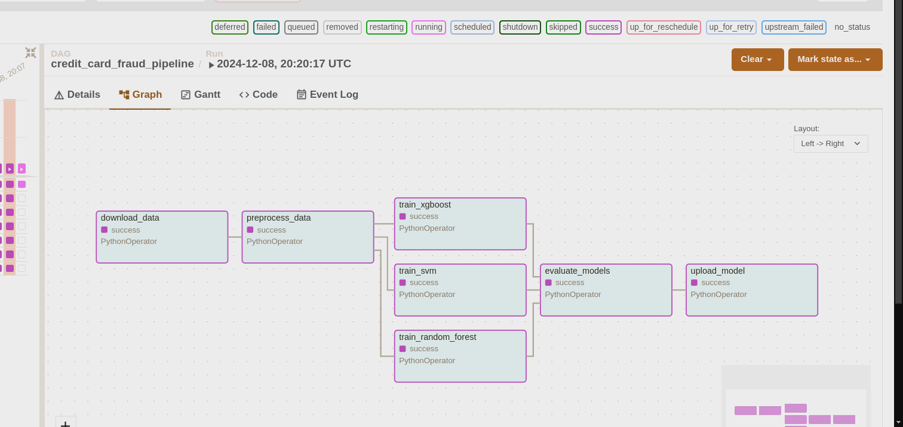
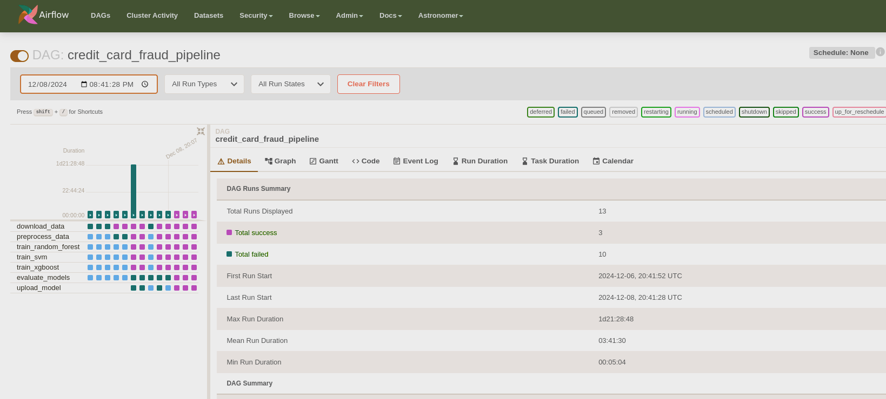
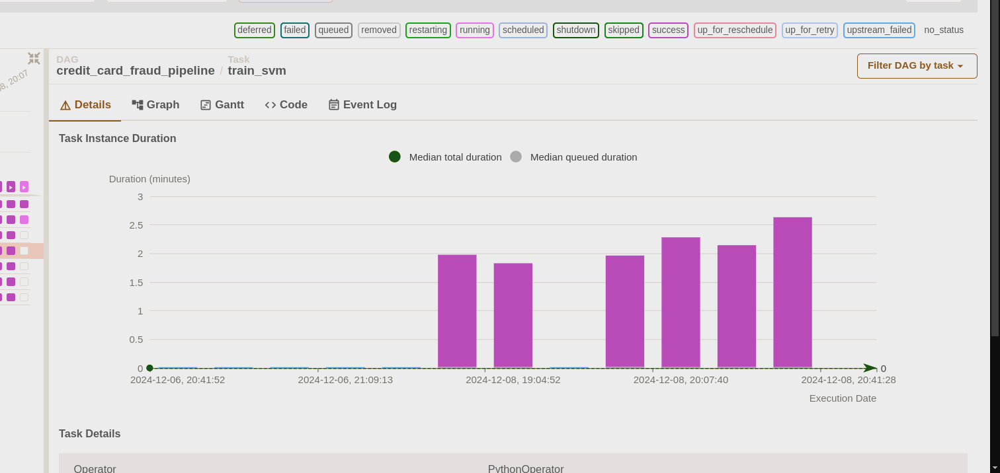

# Credit Card Fraud Detection Pipeline using Apache Airflow

## Overview

This repository contains an Apache Airflow pipeline for Credit Card Fraud Detection. The pipeline automates the end-to-end machine learning workflow, from data ingestion to model training, evaluation, and deployment to the cloud.


## Features

- **Automated Data Ingestion**: Downloads data from Azure Blob Storage.
- **Data Preprocessing**: Cleans and formats data for training.
- **Model Training**: Trains three different models (Random Forest, SVM, XGBoost) in parallel.
- **Model Evaluation**: Compares model performance and selects the best one.
- **Cloud Deployment**: Uploads the best model to Azure Storage.
- **Scalable Execution**: Managed via Apache Airflow DAG.

## Pipeline Architecture

The workflow is orchestrated using Apache Airflow DAG and follows this sequence:

1. Download Data from Azure Blob Storage.
2. Preprocess Data (Feature Engineering, Cleaning, Formatting).
3. Train Models (Random Forest, SVM, XGBoost) in parallel.
4. Evaluate Models to determine the best-performing model.
5. Upload Best Model to Azure Storage.

## DAG Workflow Diagram



## File Structure

```
├── dags/
│   └── credit_card_fraud_pipeline.py # Airflow DAG definition
├── scripts/
│   ├── download_data.py # Fetch data from Azure Blob Storage
│   ├── preprocess_data.py # Data cleaning and transformation
│   ├── train_model_rf.py # Train Random Forest model
│   ├── train_model_svm.py # Train SVM model
│   ├── train_model_xgb.py # Train XGBoost model
│   ├── evaluate_models.py # Model evaluation and selection
│   ├── upload_model.py # Upload best model to Azure
├── requirements.txt # Python dependencies
├── README.md # Project documentation
```

## Getting Started

### Prerequisites

Before running the pipeline, ensure you have:

- Python 3.8+
- Apache Airflow 2.x
- Azure Storage Account
- Docker (Optional, for running Airflow in containers)

### Installation

1. **Clone the Repository**

   ```sh
   git clone https://github.com/NeelDevenShah/Credit-Card-Fraud-Astronomer-Airflow
   cd Credit-Card-Fraud-Astronomer-Airflow
   ```

2. **Create a Virtual Environment**

   ```sh
   python -m venv venv
   source venv/bin/activate # On Mac/Linux
   venv\Scripts\activate # On Windows
   ```

3. **Install Dependencies**

   ```sh
   pip install -r requirements.txt
   ```

4. **Start Apache Airflow**

   ```sh
   # Initialize Airflow
   airflow db init

   # Start Scheduler & Webserver
   airflow scheduler & airflow webserver
   ```

## DAG Breakdown

1. **Download Data**

   Fetches credit card transaction data from Azure Blob Storage.
   Saves the file locally in `tmp/creditcard.txt`.

2. **Preprocess Data**

   Splits data into `X_train.csv`, `y_train.csv`, `X_test.csv`, `y_test.csv`.

3. **Train Models (Parallel Execution)**

   - Random Forest (`train_model_rf.py`)
   - SVM (`train_model_svm.py`)
   - XGBoost (`train_model_xgb.py`)

4. **Evaluate Models**

   Compares model performance using `evaluate_models.py`.
   Saves the best model in `tmp/best_model.txt`.

5. **Upload Best Model to Azure**

   Uses `upload_model.py` to store the best model in Azure Blob Storage.

## Running the Pipeline

- Enable the DAG in Airflow UI.
- Trigger the DAG manually or schedule it.
- Monitor execution in the Airflow Web UI.

## Deployment on Azure (Optional)

To deploy the Airflow DAG in Azure Container Apps, follow these steps:

1. **Build Docker Image**

   ```sh
   docker build -t airflow-cc-fraud .
   ```

2. **Push to Azure Container Registry**

   ```sh
   docker push your-acr.azurecr.io/airflow-cc-fraud
   ```

3. **Deploy on Azure Container Apps**

   ```sh
   az container create --resource-group <your-rg> --name airflow-dag \
    --image your-acr.azurecr.io/airflow-cc-fraud \
    --cpu 2 --memory 4 \
    --environment-variables AIRFLOW__CORE__EXECUTOR=CeleryExecutor
   ```

## Monitoring & Debugging




### Airflow UI Screenshots

- DAG Status
- Task Logs
- Live Execution

## Contributing

If you’d like to improve this pipeline, feel free to fork the repo, create a branch, and submit a pull request.

## License

This project is licensed under the MIT License.

## Contact

📧 Neel Shah - neeldevenshah.ai@gmail.com
